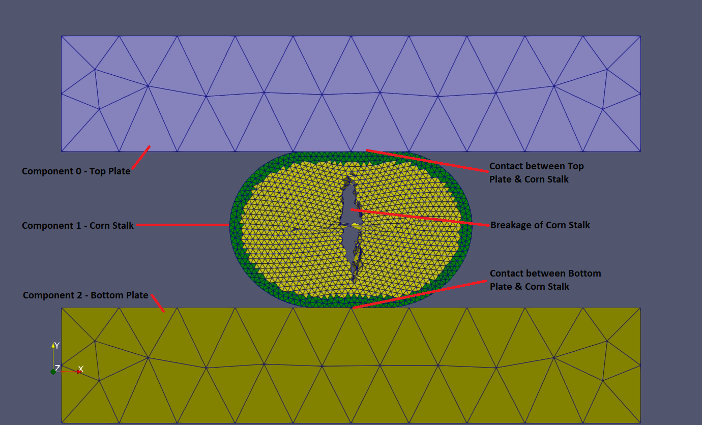
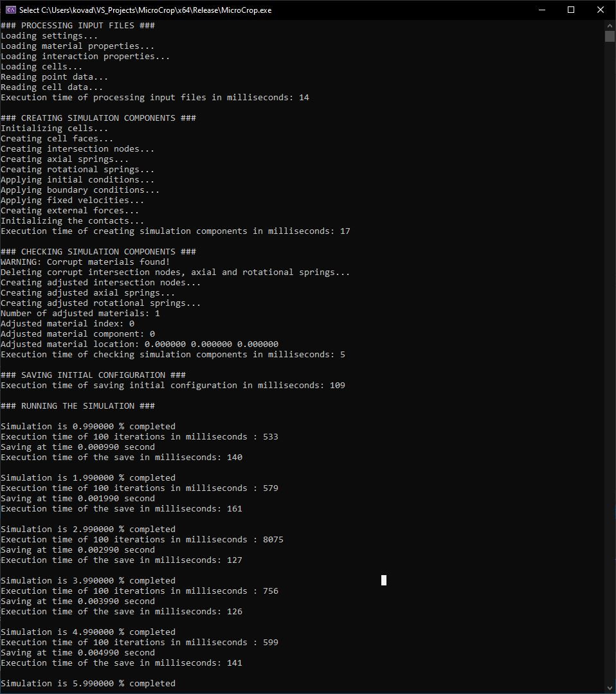

# MicroCrop - Crop Solver by Adam

## Motivation

This application was created to practice C++ & CUDA C/C++ coding after completing [NVIDIA Fundamentals of Accelerated Computing with CUDA C/C++](https://courses.nvidia.com/courses/course-v1:DLI+C-AC-01+V1/about).

Since the beginning of my university studies of agricultural engineering, simulating agricultural equipment is my passion. 
I was especially interested in new technologies to simulate processing of agricultural materials. 
One day I ran into an interesting study on mass-spring systems: [Oussama Jarrousse: Modified Mass-Spring System for Physically Based Deformation Modeling](https://www.researchgate.net/publication/342899408_Modified_Mass-spring_System_for_Physically_Based_Deformation_Modeling). 
The author used this method to simulate human organs like breast and heart, so I thought it can be used for agricultural materials too.
Nonetheless, implementing this method into a C++ & CUDA C/C++ code seemed to be a perfect exercise to practice my new knowledge.

My certificate:


## Short description

In the simulation, each component (body) is consisted of tetrahedral cells.
The mechanical behaviour of the cells are defined by axial and rotational springs and dampers.
Contact is detected among the cells that belong to the same or different components.
The mechanical behaviour of the contact between two components is determined by the interaction properties such as contact stiffness and coefficient of static friction.
The components are able to deform according to the contact and external forces acting on them.
The cells can be damaged and this can result in breakage of the component.
Initial and boundary conditions can be defined onto the components at the beginning of the simulation.
Nonetheless, external forces (like gravity) and fixed velocities can be applied onto the components as well.

Input parameters:
* Tetrahedral mesh for each component;
* Material definition for each component;
* Interaction definition among the components;
* Initial conditions;
* Boundary conditions;
* External forces;
* Fixed velocities;
* Solver settings;
* Save setting.

Result files:
* Log file (TXT) with solver messages;
* Node output file (VTK);
* Cell output file (VTK);
* Face output file (VTK);
* Axial spring output file (VTK);
* Rotational spring output file (VTK);
* Contact output file (VTK);
* External force output file (VTK).

The VTK output files can be processed and visualized in [Paraview](https://www.paraview.org/).

The solver was developed in [Microsoft Visual Studio 2019](https://visualstudio.microsoft.com/) by using [ISO C++14 standard](https://en.cppreference.com/w/cpp/14) and [NVIDIA CUDA 11.3](https://docs.nvidia.com/cuda/index.html).



## User guide

In this section the usage of the application will be presented.

### Input files

The input parameters for the solver are defined in multiple files. 
Let's start with the basic Settings.txt file.

#### Settings

The Settings.txt has to be located in the root **/0_INPUT** folder.
In the Settings.txt file there are multiple keywords defined to control the input paramters.
Some of them is optional and some of them is mandatory.
On the following list the **mandatory** keywords are **bold**:
* **NUMBER_OF_COMPONENTS** *numComponents*: Defines the number of components (bodies) in the simulation. This has to be at the very top of the setting file.
* **CELLS** *numComponents*: Defines the location of the tetrahedral mesh files. Each component has to have a mesh file.
* **MATERIALS** *numComponents*: Defines the location of the material definition files. Each component has to have a material file.

* INTERACTIONS *numInteractions*: Defines the location of the interaction file(s).
* INITIAL_CONDITION *numInitialCondition*: Defines the location of the initial condition file(s).
* BOUNDARY_CONDITION *numBoundaryCondition*: Defines the location of the boundary condition file(s).
* EXTERNAL_FORCE *numExternalForce*: Defines the location of the external force file(s).
* FIXED_VELOCITY *numFixedVelocity*: Defines the location of the fixed velocity file(s).

* **OUTPUTFOLDER**: Defines the location of the output folder.

* **NUMBER_OF_CPU_THREADS** *numCpuThreads*: Defines the number of CPU threads for the solver.
* SIMULATION_ON_GPU *1/0*: Defines if the simulation runs on a GPU device.
* GPU_DEVICE *deviceID*: Defines the ID of the GPU device.
* GPU_THREADS_PER_BLOCK *numThreadsPerBlock*: Defines the number of GPU threads per GPU blocks.
* GPU_NUMBER_OF_BLOCKS *numBlock*: Defines the number of GPU blocks.

* ADJUST_ANGLE_X *radAngle*: Defines the angle to adjust anisotropy axis around axis X in radians.
* ADJUST_ANGLE_Y *radAngle*: Defines the angle to adjust anisotropy axis around axis Y in radians.
* ADJUST_ANGLE_Z *radAngle*: Defines the angle to adjust anisotropy axis around axis Z in radians.

* **START_TIME** *startTime*: Defines the starting time of the simulation in seconds.
* **END_TIME** *endTime*: Defines the end time of the simulation in seconds.
* **TIMESTEP** *timeStep*: Defines the time step for the solver in seconds.
* GLOBAL_DAMPING *globalDamping*: Defines the global damping for the solver. It ranges between 0.0 and 1.0.

* **SAVE_INTERVAL** *saveInterval*: Defines the save interval for the solver in seconds.

* SAVE_NODES *1/0*: Inidicates to save a result file on the nodes. The saved data is defined by the following keywords:
  * SAVE_NODE_ID *1/0*: Indicates to save the node ID.
  * SAVE_NODE_COMPONENT *1/0*: Indicates to save the component ID to which the node belongs.
  * SAVE_NODE_MASS *1/0*: Indicates to save the nodal mass.
  * SAVE_NODE_FORCE *1/0*: Indicates to save the nodal force.
  * SAVE_NODE_VELOCITY *1/0*: Indicates to save the nodal velocity.
  * SAVE_NODE_ACCELERATION *1/0*: Indicates to save the nodal acceleration.
  * SAVE_NODE_FIXED_VELOCITY *1/0*: Indicates to save the fixed velocity applied onto the node.
  * SAVE_NODE_BOUNDARIES *1/0*: Indicates to save the applied boundary conditions onto the node.

* SAVE_CELLS *1/0*: Indicates to save a result file on the cells. The saved data is defined by the following keywords:
  * SAVE_CELL_ID *1/0*: Indicates to save the cell ID.
  * SAVE_CELL_COMPONENT *1/0*: Indicates to save the component to which the cell belongs.
  * SAVE_CELL_STATUS *1/0*: Indicates to save the status of the cell (1 - active; 2 - damaged).
  * SAVE_CELL_MATERIAL_PROPERTY *1/0*: Indicates to save the material property index.
  * SAVE_CELL_VOLUME *1/0*: Indicates to save the cell volume.
  * SAVE_CELL_MASS *1/0*: Indicates to save the cell mass.
  * SAVE_CELL_NODE_ID *1/0*: Indicates to save the node IDs that belong to the cell.
  * SAVE_CELL_NODE_MASS *1/0*: Indicates to save the nodal masses that belong to the cell.
  * SAVE_CELL_NODE_FORCE *1/0*: Indicates to save the nodal forces that belong to the cell.
  * SAVE_CELL_NODE_VELOCITY *1/0*: Indicates to save the nodal velocities that belong to the cell.
  * SAVE_CELL_NODE_ACCELERATION *1/0*: Indicates to save the nodal velocities that belong to the cell.

* SAVE_FACES *1/0*: Indicates to save a result file on the faces. The saved data is defined by the following keywords:
  * SAVE_FACE_ID *1/0*: Indicates to save the face ID.
  * SAVE_FACE_COMPONENT *1/0*: Indicates to save component to which the face belongs.
  * SAVE_FACE_CELL_ID *1/0*: Indicates to save the cell ID to which the face belings.
  * SAVE_FACE_AREA *1/0*: Indicates to save the area of the face.
  * SAVE_FACE_NORMAL *1/0*: Indicates to save the face normal.

* SAVE_AXIAL_SPRINGS *1/0*: Indicates to save a result file on the axial springs. The saved data is defined by the following keywords:
  * SAVE_AXIAL_SPRING_ID *1/0*: Indicates to save the axial spring ID.
  * SAVE_AXIAL_SPRING_COMPONENT *1/0*: Indicates to save the component to which the axial spring belongs.
  * SAVE_AXIAL_SPRING_CELL_ID *1/0*: Indicates to save the cell ID to which the axial spring belongs to.
  * SAVE_AXIAL_SPRING_TENSILE_STIFFNESS *1/0*: Indicates to save the tensile stiffness of the axial spring.
  * SAVE_AXIAL_SPRING_COMPRESSIVE_STIFFNESS *1/0*: Indicates to save the compressive stiffness of the axial spring.
  * SAVE_AXIAL_SPRING_TENSILE_DAMPING *1/0*: Indicates to save the tensile damping of the axial spring.
  * SAVE_AXIAL_SPRING_COMPRESSIVE_DAMPING *1/0*: Indicates to save the compressive damping of the axial spring.
  * SAVE_AXIAL_SPRING_TENSILE_STRENGTH *1/0*: Indicates to save the tensile strength of the axial spring.
  * SAVE_AXIAL_SPRING_COMPRESSIVE_STRENGTH *1/0*: Indicates to save the compressive strength of the axial spring.
  * SAVE_AXIAL_SPRING_LOADCASE *1/0*: Indicates to save the load case of the axial spring (0 - not loaded; 1 - tension; 2 - compression).
  * SAVE_AXIAL_SPRING_LENGTH *1/0*: Indicates to save the length of the axial spring.
  * SAVE_AXIAL_SPRING_SPRING_FORCE *1/0*: Indicates to save the spring force of the axial spring.
  * SAVE_AXIAL_SPRING_DAMPING_FORCE *1/0*: Indicates to save the damping force of the axial spring.
  * SAVE_AXIAL_SPRING_TOTAL_FORCE *1/0*: Indicates to save the total (spring + damping) force of the axial spring.

* SAVE_ROTATIONAL_SPRINGS *1/0*: Indicates to save a result file on the rotational springs. The saved data is defined by the following keywords:
  * SAVE_ROTATIONAL_SPRING_ID *1/0*: Indicates to save the rotational spring ID.
  * SAVE_ROTATIONAL_COMPONENT *1/0*: Indicates to save the component to which the rotational spring belongs.
  * SAVE_ROTATIONAL_SPRING_CELL_ID *1/0*: Indicates to save the cell ID to which the rotational spring belongs.
  * SAVE_ROTATIONAL_SPRING_STIFFNESS *1/0*: Indicates to save the stiffness of the rotational spring.
  * SAVE_ROTATIONAL_SPRING_ANGLE *1/0*: Indicates to save the angle of the rotational spring.
  * SAVE_ROTATIONAL_SPRING_FORCE *1/0*: Indicates to save the spring force of the rotational spring.

* SAVE_CONTACTS *1/0*: Indicates to save a result file on the contacts. The save data is defined by the following keywords:
  * SAVE_CONTACT_ID *1/0*: Indicates to save the contact ID.
  * SAVE_CONTACT_FACE *1/0*: Indicates to save the face ID involved in the interaction.
  * SAVE_CONTACT_FRICTION *1/0*: Indicates to save the coefficient of static friction assigned to the interaction.
  * SAVE_CONTACT_NORMAL_STIFFNESS *1/0*: Indicates to save the normal stiffness assigned to the interaction.
  * SAVE_CONTACT_TANGENTIAL_STIFFNESS *1/0*: Indicates to save the tangential stiffness assigned to the interaction.
  * SAVE_CONTACT_NORMAL_OVERLAP *1/0*: Indicates to save the normal overlap of the interaction.
  * SAVE_CONTACT_TANGENTIAL_OVERLAP *1/0*: Indicates to save the tangential overlap of the interaction.
  * SAVE_CONTACT_NORMAL_FORCE *1/0*: Indicates to save the normal force of the interaction.
  * SAVE_CONTACT_TANGENTIAL_FORCE *1/0*: Indicates to save the tangential force of the interaction.
  * SAVE_CONTACT_TOTAL_FORCE *1/0*: Indicates to save the total (normal + tangential) force of the interaction.

* SAVE_EXTERNAL_FORCES *1/0*: Indicates to save a result file on the external forces. The saved data is defined by the following keywords:
  * SAVE_EXTERNAL_FORCE_ID *1/0*: Indicates to save the external force ID.
  * SAVE_EXTERNAL_FORCE_TYPE *1/0*: Indicates to save the type of the external force (0 - gravitational; 1 - global; 2 - component; 3 - plane; 4 - local).
  * SAVE_EXTERNAL_FORCE_VALUE *1/0*: Indicates to save the value of the external force.

An exmple Settings.txt file:

```
NUMBER_OF_COMPONENTS 1

CELLS 1
0_INPUT/Cube_Size_0_01.vtk

MATERIALS 1
0_INPUT/Cube_Materials.txt

INTERACTIONS 0

INITIAL_CONDITION 0

BOUNDARY_CONDITION 1
0_INPUT/Cube_BoundaryCondition.txt

EXTERNAL_FORCE 1
0_INPUT/Cube_ExternalForce.txt

FIXED_VELOCITY 0

OUTPUTFOLDER
1_OUTPUT/SingleCubeTensileTest/

NUMBER_OF_CPU_THREADS 12

SIMULATION_ON_GPU 0
GPU_DEVICE 0
GPU_THREADS_PER_BLOCK 256
GPU_NUMBER_OF_BLOCKS 128

ADJUST_ANGLE_X 0.0174533
ADJUST_ANGLE_Y 0.0174533
ADJUST_ANGLE_Z 0.0174533

START_TIME 0.0
END_TIME 1e-1
TIMESTEP 1e-5
GLOBAL_DAMPING 0.0

SAVE_INTERVAL 1e-3

SAVE_NODES 1
SAVE_NODE_ID 1
SAVE_NODE_COMPONENT 1
SAVE_NODE_MASS 1
SAVE_NODE_FORCE 1
SAVE_NODE_VELOCITY 1
SAVE_NODE_ACCELERATION 1
SAVE_NODE_FIXED_VELOCITY 1
SAVE_NODE_BOUNDARIES 1

SAVE_CELLS 1
SAVE_CELL_ID 1
SAVE_CELL_COMPONENT 1
SAVE_CELL_STATUS 1
SAVE_CELL_MATERIAL_PROPERTY 1
SAVE_CELL_VOLUME 1
SAVE_CELL_MASS 1
SAVE_CELL_NODE_ID 1
SAVE_CELL_NODE_MASS 1
SAVE_CELL_NODE_FORCE 1
SAVE_CELL_NODE_VELOCITY 1
SAVE_CELL_NODE_ACCELERATION 1

SAVE_FACES 1
SAVE_FACE_ID 1
SAVE_FACE_COMPONENT 1
SAVE_FACE_CELL_ID 1
SAVE_FACE_AREA 1
SAVE_FACE_NORMAL 1

SAVE_AXIAL_SPRINGS 1
SAVE_AXIAL_SPRING_ID 1
SAVE_AXIAL_SPRING_COMPONENT 1
SAVE_AXIAL_SPRING_CELL_ID 1
SAVE_AXIAL_SPRING_TENSILE_STIFFNESS 1
SAVE_AXIAL_SPRING_COMPRESSIVE_STIFFNESS 1
SAVE_AXIAL_SPRING_TENSILE_DAMPING 1
SAVE_AXIAL_SPRING_COMPRESSIVE_DAMPING 1
SAVE_AXIAL_SPRING_TENSILE_STRENGTH 1
SAVE_AXIAL_SPRING_COMPRESSIVE_STRENGTH 1
SAVE_AXIAL_SPRING_LOADCASE 1
SAVE_AXIAL_SPRING_LENGTH 1
SAVE_AXIAL_SPRING_SPRING_FORCE 1
SAVE_AXIAL_SPRING_DAMPING_FORCE 1
SAVE_AXIAL_SPRING_TOTAL_FORCE 1

SAVE_ROTATIONAL_SPRINGS 1
SAVE_ROTATIONAL_SPRING_ID 1
SAVE_ROTATIONAL_COMPONENT 1
SAVE_ROTATIONAL_SPRING_CELL_ID 1
SAVE_ROTATIONAL_SPRING_STIFFNESS 1
SAVE_ROTATIONAL_SPRING_ANGLE 1
SAVE_ROTATIONAL_SPRING_FORCE 1

SAVE_CONTACTS 0
SAVE_CONTACT_ID 0
SAVE_CONTACT_FACE 0
SAVE_CONTACT_FRICTION 0
SAVE_CONTACT_NORMAL_STIFFNESS 0
SAVE_CONTACT_TANGENTIAL_STIFFNESS 0
SAVE_CONTACT_NORMAL_OVERLAP 0
SAVE_CONTACT_TANGENTIAL_OVERLAP 0
SAVE_CONTACT_NORMAL_FORCE 0
SAVE_CONTACT_TANGENTIAL_FORCE 0
SAVE_CONTACT_TOTAL_FORCE 0

SAVE_EXTERNAL_FORCES 1
SAVE_EXTERNAL_FORCE_ID 1
SAVE_EXTERNAL_FORCE_TYPE 1
SAVE_EXTERNAL_FORCE_VALUE 1
```

#### Cells input file structure

The cells input file is basically a VTK file that contains the mesh (points and cells) of the component.
So, it has to contain two keywords:
* POINTS *numPoints* *dataType* followed by the X-Y-Z coordinates
* CELLS *numCells* *numData* followed by the number of points that a cell contains and the indices of the points

The order of the keywords matters: **POINTS has to come first and then CELLS**.

You can see an exmple cells input file below.
In this file, 8 points define 2 tetrahedral cells.

```
# vtk DataFile Version 4.2
vtk output
ASCII
DATASET UNSTRUCTURED_GRID

POINTS 8 float
0.00005 0.00025 0.0001
-0.0006 0.00025 0.0001
0.00005 0.00075 0.0001
0.00005 0.00075 0.0006
0.003 0.001 0.0
0.007 0.002 0.0
0.005 0.005 0.0
0.005 0.00267 0.005

CELLS 2 10
4 0 1 2 3 
4 4 5 6 7 

CELL_TYPES 2
10
10
```

#### Materials input file structure

The materials input file is a simple text file.
It contains all the necessary information for the material definitions.
The following keywords has to be defined:
* NUMBER *numMaterials*: This defines how many materials definition we have. **This keyword has to be at the very top of the file**.
* LOCATION *x y z*: This defines where the material is defined in the Certesian space: X-Y-Z coordinates in meter.
* DENSITY *density*: This defines the density at the given location: kg m <sup>-3</sup>.
* ANISOTROPY_AXIS *x0 y0 z0 x1 y1 z1 z2 y2 z2*: This defines the orientation of the three anisotropy axes at the given location. **The axes have to be normalized**.
* ANISOTROPY_TENSILE_STIFFNESS *k0 k1 k2*: This defines the tensile stiffness for each anisotropy axis: N m <sup>-1</sup> .
* ANISOTROPY_COMPRESSIVE_STIFFNESS *k0 k1 k2*: This defines the compressive stiffness for each anisotopy axis: N m <sup>-1</sup>.
* ANISOTROPY_TENSILE_DAMPING *d0 d1 d2*: This defines the tensile damping for each anisotopy axis: N s m <sup>-1</sup>.
* ANISOTROPY_COMPRESSIVE_DAMPING *d0 d1 d2*: This defines the compressive damping for each anisotopy axis: N s m <sup>-1</sup>.
* ANISOTROPY_ROT_STIFFNESS *k0 k1 k2*: This defines the rotational stiffness for each rotational spring: N rad <sup>-1</sup>.
* ANISOTROPY_SPRING_TENSILE_STRENGTH: *s0 s1 s2*: This defines the tensile strength for each axial spring: N.
* ANISOTROPY_SPRING_COMPRESSIVE_STRENGTH: *s0 s1 s2*: This defines the compressive strength for each axial spring: N.

You can see an example materials input file in which one material property is defined below.

```
NUMBER
1

LOCATION
0.0 0.0 0.0

DENSITY
1200

ANISOTROPY_AXIS
1.0 0.0 0.0 
0.0 1.0 0.0
0.0 0.0 1.0

ANISOTROPY_TENSILE_STIFFNESS
1e0
1e0
1e0

ANISOTROPY_COMPRESSIVE_STIFFNESS
1e0
1e0
1e0

ANISOTROPY_TENSILE_DAMPING
1e-2
1e-2
1e-2

ANISOTROPY_COMPRESSIVE_DAMPING
1e-2
1e-2
1e-2

ANISOTROPY_ROT_STIFFNESS
1e0
1e0
1e0

ANISOTROPY_SPRING_TENSILE_STRENGTH
1e3
1e3
1e3

ANISOTROPY_SPRING_COMPRESSIVE_STRENGTH
1e3
1e3
1e3
```

#### Interactions input file structure

The interactions input file defines the mechanical behaviour of the interactions among the cells.
The interaction are defined on component (body) level.
The following keywords have to be defined in the interactions intput file:
* INTERACTION *numInteractions*: This defines how many interaction is defined. This is followed by the mechanical properties:
  * ComponentAid(#) ComponentBid(#) CoefficientOfStaticFriction(-) NormalContactStiffness(N m <sup>-1</sup>) TangentialContactStiffness(N m <sup>-1</sup>).

The component IDs are defined based on the order of their cells input file is defined in the Setting.txt file.

You can see an example below.

```
INTERACTION 3
0 1 0.2 2e6 1e6
1 1 0.2 2e6 1e6
1 2 0.2 2e6 1e6
```

#### Initial conditions input file structure

The initial conditions input file contains the applied initial conditions. 
There are four main initial condition types:
* Global: these initial conditions will be applied onto all the cell nodes.
* Component: these initial conditions will be applied onto the cell nodes that belong to a certain component.
* Plane: these initial conditions will be applied onto the cell nodes that lay on a defined plane.
* Local: these initial conditions will be applied onto **one cell node that is the closest** to the defined location. So, the cell node does not have to be in the exact position, the closest one will be selected.

Accordingly, the following keywords can be defined in an initial condition input file:
* GLOBAL *1/0*: This defines if a global initial condition is applied:
  * VelocityX(m s <sup>-1</sup>) VelocityY(m s <sup>-1</sup>) VelocityZ(m s <sup>-1</sup>).

* COMPONENT *numConditions*: This defines how many initial conditions are defined component-wise:
  * ComponentID(#) VelocityX(m s <sup>-1</sup>) VelocityY(m s <sup>-1</sup>) VelocityZ(m s <sup>-1</sup>).

* PLANE *numConditions*: This defines how many planner initial conditions are defined:
  * LocationX(m) LocationY(m) LocationZ(m) NormalX(-) NormalY(-) NormalZ(-) VelocityX(m s <sup>-1</sup>) VelocityY(m s <sup>-1</sup>) VelocityZ(m s <sup>-1</sup>).

* LOCAL *numConditions*: This defines how many local initial conditions are defined:
  * LocationX(m) LocationY(m) LocationZ(m) VelocityX(m s <sup>-1</sup>) VelocityY(m s <sup>-1</sup>) VelocityZ(m s <sup>-1</sup>).

You can see an example below.

```
GLOBAL 0
1.0 0.0 0.0

COMPONENT 1
0 1.0 0.0 0.0

PLANE 0
0.0 0.0 0.0 1.0 0.0 0.0 1.0 0.0 0.0

LOCAL 0
0.00005 0.00025 0.0001 1.0 0.0 0.0
```

#### Boundary conditions input file structure

The boundary conditions input file contains the applied boundary conditions. 
There are four main boundary condition types:
* Global: these boundary conditions will be applied onto all the cell nodes.
* Component: these boundary conditions will be applied onto the cell nodes that belong to a certain component.
* Plane: these boundary conditions will be applied onto the cell nodes that lay on a defined plane.
* Local: these boundary conditions will be applied onto **one cell node that is the closest** to the defined location. So, the cell node does not have to be in the exact position, the closest one will be selected.

Accordingly, the following keywords can be defined in a boundary condition input file:
* GLOBAL *1/0*: This defines if a global boundary condition is applied:
  * FixedX(0/1) FixedY(0/1) FixedZ(0/1).

* COMPONENT *numConditions*: This defines how many boundary conditions are defined component-wise:
  * ComponentID(#) FixedX(0/1) FixedY(0/1) FixedZ(0/1).

* PLANE *numConditions*: This defines how many planner boundary conditions are defined:
  * LocationX(m) LocationY(m) LocationZ(m) NormalX(-) NormalY(-) NormalZ(-) FixedX(0/1) FixedY(0/1) FixedZ(0/1).

* LOCAL *numConditions*: This defines how many local boundary conditions are defined:
  * LocationX(m) LocationY(m) LocationZ(m) FixedX(0/1) FixedY(0/1) FixedZ(0/1).

You can see an example below.

```
GLOBAL 0
0 1 0

COMPONENT 0
0 0 1 0

PLANE 1
0.0 0.0 0.0 1.0 0.0 0.0 1 1 1

LOCAL 0
0.01 0.01 0.0 1 1 1
```

#### External forces input file structure

The external forces input file contains the applied external forces.
Each external force has a start time and a duration, so it will be active only in a certain time interval. 
There are five main external force types:
* Gravitational: the gravitational forces will be applied onto all the cell nodes.
* Global: these external forces will be applied onto all the cell nodes.
* Component: these external forces will be applied onto the cell nodes that belong to a certain component.
* Plane: these external forces will be applied onto the cell nodes that lay on a defined plane.
* Local: these external forces will be applied onto **one cell node that is the closest** to the defined location. So, the cell node does not have to be in the exact position, the closest one will be selected.

Accordingly, the following keywords can be defined in an external force input file:
* GRAVITY *numForces*: This defines how many gravitational forces are defined:
  * StartTime(s) DurationTime(s) GravityX(m s<sup>-2</sup>) GravityY(m s<sup>-2</sup>) GravityZ(m s<sup>-2</sup>).

* GLOBAL *numForces*: This defines how many global external forces are applied:
  * StartTime(s) DurationTime(s) ForceX(N) ForceY(N) ForceZ(N).

* COMPONENT *numForces*: This defines how many external forces are defined component-wise:
  * ComponentID(#) StartTime(s) DurationTime(s) ForceX(N) ForceY(N) ForceZ(N).

* PLANE *numForces*: This defines how many planner external forces are defined:
  * LocationX(m) LocationY(m) LocationZ(m) NormalX(-) NormalY(-) NormalZ(-) StartTime(s) DurationTime(s) ForceX(N) ForceY(N) ForceZ(N).

* LOCAL *numForces*: This defines how many local external forces are defined:
  * LocationX(m) LocationY(m) LocationZ(m) StartTime(s) DurationTime(s) ForceX(N) ForceY(N) ForceZ(N).

You can see an example below.

```
GRAVITY 1
0.0 9999.0 0.0 -9.81 0.0

GLOBAL 0
0.0 0.1 1.0 0.0 0.0

COMPONENT 0
0 0.0 0.1 1.0 0.0 0.0

PLANE 2
0.0 0.0 0.0 1.0 0.0 0.0 0.0 9999.0 -0.001 0.0 0.0
0.01 0.0 0.0 1.0 0.0 0.0 0.0 9999.0 0.001 0.0 0.0

LOCAL 0
0.0 0.0 0.01 0.0 9999.0 1.0 0.0 0.0
```

#### Fixed velocities input file structure

The fixed velocities input file contains the applied fixed velocities. 
There are four main fixed velocity types:
* Global: these fixed velocities will be applied onto all the cell nodes.
* Component: these fixed velocities will be applied onto the cell nodes that belong to a certain component.
* Plane: these fixed velocities will be applied onto the cell nodes that lay on a defined plane.
* Local: these fixed velocities will be applied onto **one cell node that is the closest** to the defined location. So, the cell node does not have to be in the exact position, the closest one will be selected.

Accordingly, the following keywords can be defined in a fixed velocity input file:
* GLOBAL *1/0*: This defines if a global fixed velocity is applied:
  * VelocityX(m s <sup>-1</sup>) VelocityY(m s <sup>-1</sup>) VelocityZ(m s <sup>-1</sup>).

* COMPONENT *numVelocities*: This defines how many fixed velocities are defined component-wise:
  * ComponentID(#) VelocityX(m s <sup>-1</sup>) VelocityY(m s <sup>-1</sup>) VelocityZ(m s <sup>-1</sup>).

* PLANE *numVelocities*: This defines how many planner fixed velocities are defined:
  * LocationX(m) LocationY(m) LocationZ(m) NormalX(-) NormalY(-) NormalZ(-) VelocityX(m s <sup>-1</sup>) VelocityY(m s <sup>-1</sup>) VelocityZ(m s <sup>-1</sup>).

* LOCAL *numVelocities*: This defines how many local fixed velocities are defined:
  * LocationX(m) LocationY(m) LocationZ(m) VelocityX(m s <sup>-1</sup>) VelocityY(m s <sup>-1</sup>) VelocityZ(m s <sup>-1</sup>).

You can see an example below.

```
GLOBAL 0
1.0 0.0 0.0

COMPONENT 2
0 0.0 -3.333333 0.0
2 0.0 0.0 0.0

PLANE 0
0.0 0.0 0.0 1.0 0.0 0.0 1.0 0.0 0.0

LOCAL 0
0.00005 0.00025 0.0001 1.0 0.0 0.0
```

### Running a simulation

After running a simulation the console window pops up where you can see the actual status of the run.

A usual run consists of the following steps:
1. Processing the input files
2. Creating simulation components
3. Checking simulation components
4. Saving the initial configuration
5. *Initialization of the GPU device (optional)*
6. Running the simulation. At the time of each saving the solver sends the following messages:
   * Percentage of completeness;
   * Execution time of the number of iterations since the last save
   * Saving at the current simulation time
   * Execution time of the saving
7. Saving the final configuration
8. Simulation completed message & total simulation time.

An example console window is shown below.



### Result files

After the simulation is completed you can find the requested result files and the log file in the defined output folder.
Depending on the save configuration the result files can be the followings:
* LogFile.txt: This contains all the solver messages (same messages you can see in the console window during the run).
* AxialSprings_Output_*saveStep*.vtk: This file contains the requested axial spring outputs at a certain *saveStep*.
* Cell_Output_*saveStep*.vtk: This file contains the requested cell outputs at a certain *saveStep*.
* ExternalForces_OutPut_*saveStep*.vtk: This file contains the requested external force outputs at a certain *saveStep*.
* Face_Output_*saveStep*.vtk: This file contains the requested face outputs at a certain *saveStep*.
* Node_Output_*saveStep*.vtk: This file contains the requested node outputs at a certain *saveStep*.
* RotationalSprings_Output_*saveStep*.vtk: This file contains the requested rotational spring outputs at a certain *saveStep*.
* Contacts_Output_*saveStep*.vtk: This file contains the requested contact outputs at a certain *saveStep*.

The VTK output files can be processed and visualized in [Paraview](https://www.paraview.org/).
Explaining the work with Paraview is not part of this documentation, but you can find useful tutorials [here](https://www.paraview.org/Wiki/ParaView_Self-directed_Tutorial).

The simulation components are visualized in the following ways:
* Cell nodes: each node is one point.
* Cell faces: each face is visualized as a triangle.
* Cells: each cell is visualized as a tetrahedron.
* Axial springs: each axial spring is visualized as a line element between the two connected intersection points.
* Rotational springs: each rotational spring is visualized as a quad element connecting the four intersection points of the two axial springs.
* Contacts: each contact is visualized as a point at the location of the node that is involved in the interaction.
* External forces: each external force is visualized as a point at the location of the node onto which it is applied.

## Small examples

In this section you can find some small examples that show the capabilities of the solver.

### One-side fixed cube with initial velocity


### Cube tensile test


### Sphere - cube eccentric collision


## A real life application - Corn stalk simulation


## Performance tests

## Limitations

## Future work & development

## Theory & background

## References

[1. Oussama Jarrousse: Modified Mass-Spring System for Physically Based Deformation Modeling, Karlsruhe Transactions on Biomedical Engineering, Vol 14, 2011](https://www.researchgate.net/publication/342899408_Modified_Mass-spring_System_for_Physically_Based_Deformation_Modeling)


