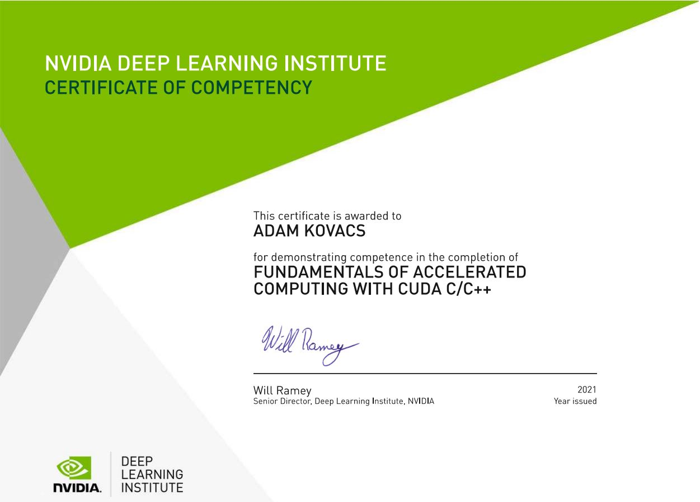

# MicroCrop - Crop Solver by Adam

## Motivation

This application was created to practice C++ & CUDA C/C++ coding after completing [NVIDIA Fundamentals of Accelerated Computing with CUDA C/C++](https://courses.nvidia.com/courses/course-v1:DLI+C-AC-01+V1/about).

Since the beginning of my university studies of agricultural engineering, simulating agricultural equipment is my passion. 
I was especially interested in new technologies to simulate processing of agricultural materials. 
One day I ran into an interesting study on mass-spring systems: [Oussama Jarrousse: Modified Mass-Spring System for Physically Based Deformation Modeling](https://www.researchgate.net/publication/342899408_Modified_Mass-spring_System_for_Physically_Based_Deformation_Modeling). 
The author used this method to simulate human organs like breast and heart, so I thought it can be used for agricultural materials too.
Nonetheless, implementing this method into a C++ & CUDA C/C++ code seemed to be a perfect exercise to practice my new knowledge.

My certificate:

## Short description

## Usage & examples

## Simulation components & settings

## Limitations

## Future work & development

## References

[1. Oussama Jarrousse: Modified Mass-Spring System for Physically Based Deformation Modeling, Karlsruhe Transactions on Biomedical Engineering, Vol 14, 2011](https://www.researchgate.net/publication/342899408_Modified_Mass-spring_System_for_Physically_Based_Deformation_Modeling)

